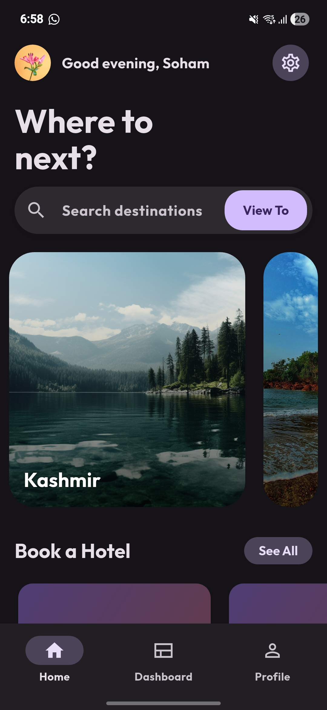
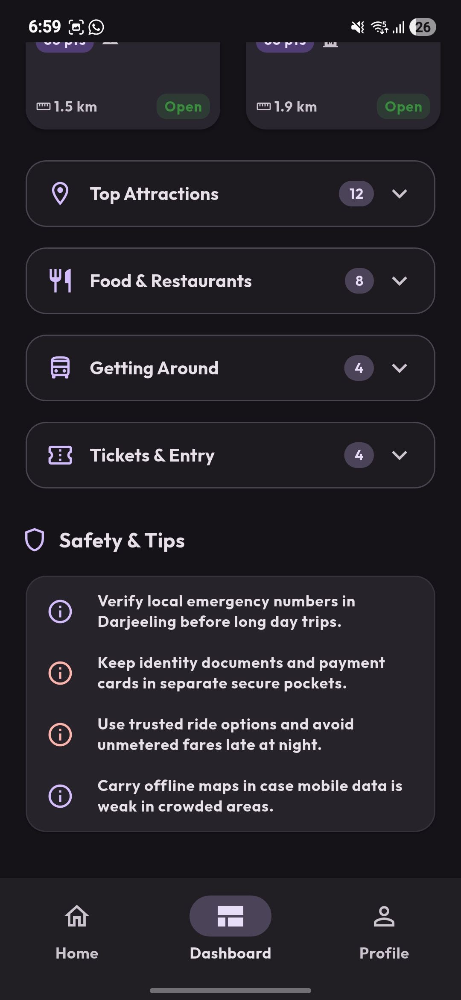
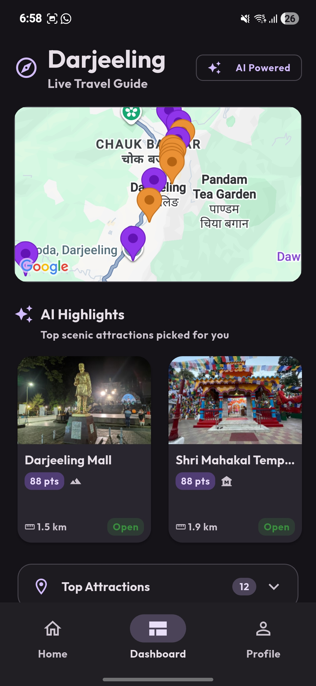
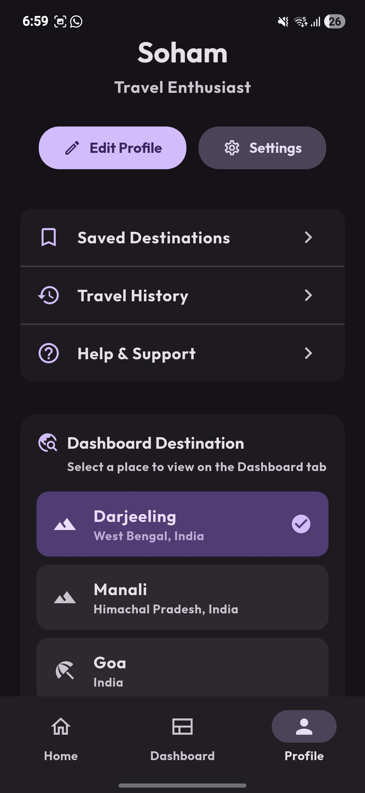
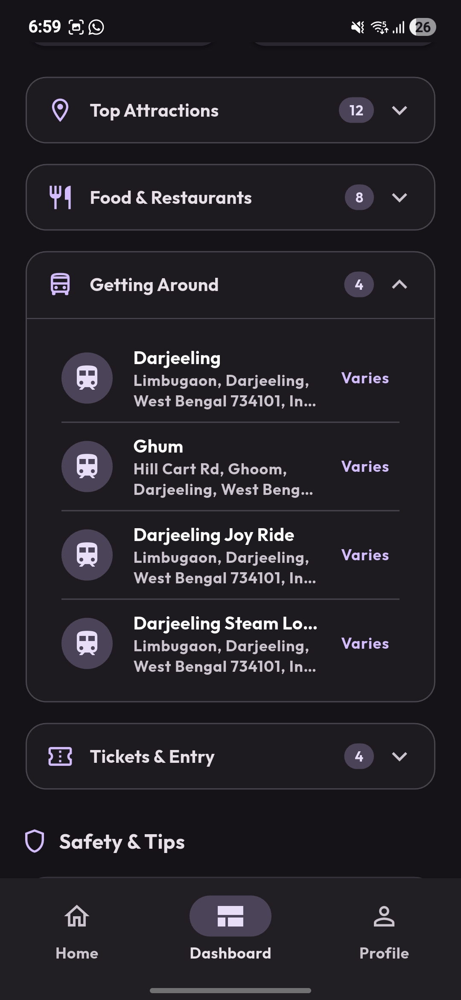

# Wanderlust

> An AI-powered Flutter travel companion — discover destinations, get smart real-time recommendations, plan trips, and book hotels in one polished Material 3 experience.

<p align="center">
  <a href="https://github.com/your-github-username/wanderlust-travel-app/releases/latest/download/wanderlust.apk">
    
  </a>
  
  
  
  
</p>

---

## Download

Get the latest Android build directly from GitHub Releases:

### [⬇️ Download Wanderlust APK](https://github.com/your-github-username/wanderlust-travel-app/releases/latest/download/wanderlust.apk)

> Replace `your-github-username` once the repository is created and the APK named `wanderlust.apk` is uploaded to the release.

---

## Highlights

- **AI Recommendation Engine** — Ranks places by proximity, rating, popularity, open-now status, and time-of-day context.
- **Live Place Data** — Real-time attractions, restaurants, photos, and ratings via Google Places API (New).
- **Interactive Map Dashboard** — Google Maps with curated markers per city.
- **Hotel Booking Flow** — Hotel cards, room types, date range, and guest selection with persistent bookings.
- **Persistent User Profile** — Saved preferences, avatar, and selected destination via SharedPreferences.
- **Material 3 UI** — Adaptive light and dark themes with custom Outfit typography.
- **Firebase Backend** — Firestore, Firebase Storage, and Firebase Auth ready out of the box.
- **City-Agnostic Architecture** — Add a new destination by appending one entry; everything else adapts.

---

## Screenshots

<p align="center">
  
  
  
</p>
<p align="center">
  
  
</p>

---

## Tech Stack

| Layer | Technology |
| --- | --- |
| Framework | Flutter, Dart |
| UI | Material 3, Outfit font family |
| Maps | `google_maps_flutter` |
| Live Data | Google Places (New), Geocoding, Distance Matrix |
| Backend | Firebase Core, Auth, Firestore, Storage |
| Local State | SharedPreferences, ChangeNotifier providers |

---

## Getting Started

### 1. Prerequisites

- Flutter SDK 3.35 or newer
- A Google Cloud project with Places API (New), Geocoding API, Distance Matrix API, and Maps SDK enabled
- A Firebase project linked to the Android app id `com.wanderlust.wanderlust`

### 2. Install Dependencies

```bash
flutter pub get
```

### 3. Configure Firebase Locally

Firebase config files are intentionally not committed. Generate them locally:

```bash
dart pub global activate flutterfire_cli
flutterfire configure
```

This creates `lib/firebase_options.dart` and `android/app/google-services.json`.

### 4. Provide Your Google Maps API Key

Run with `--dart-define`:

```bash
flutter run --dart-define=GOOGLE_MAPS_API_KEY=your_google_maps_api_key
```

For iOS, copy the sample secret config and fill in your key:

```bash
cp ios/Flutter/Secrets.xcconfig.example ios/Flutter/Secrets.xcconfig
```

The Android manifest, iOS Info.plist, and Dart `PlacesApiService` all read this key — no value is hardcoded in the repository.

---

## Build a Release APK

```bash
flutter build apk --release --dart-define=GOOGLE_MAPS_API_KEY=your_google_maps_api_key
```

The output will land at `build/app/outputs/flutter-apk/app-release.apk`. Rename it to `wanderlust.apk` and upload it to a GitHub Release so the download badge above resolves.

---

## Project Structure

```
lib/
├── constants/      # Colors, city options
├── models/         # Hotel, dashboard, recommendation models
├── providers/      # ChangeNotifier-based state
├── screens/        # Home, Dashboard, Profile, Booking, Settings
├── services/       # Places, Firestore, recommendation engine, storage
└── widgets/        # Reusable UI components
```

---

## Security and Public Repository Notes

- API keys and Firebase generated config are excluded via `.gitignore`.
- Signing keys, keystores, and `local.properties` are ignored.
- Restrict your Google and Firebase API keys in their respective consoles before publishing.

---

## License

This project is for educational and demonstration purposes. Add a license of your choice (e.g. MIT) before publishing publicly.
